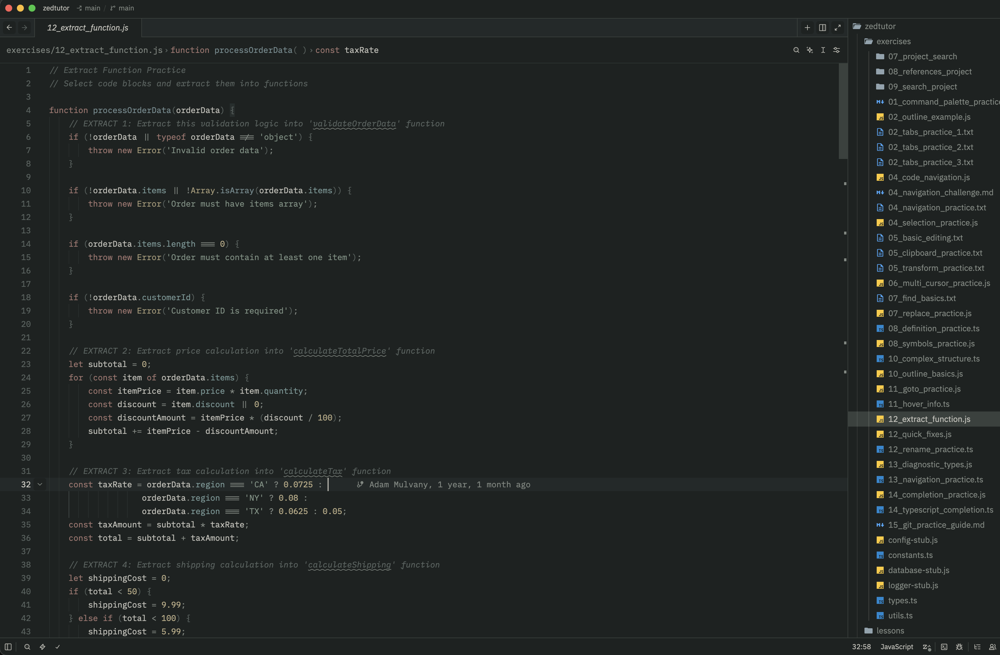

# Fuji Winter for Zed

A dark theme inspired by my Mount Fuji wallpaper — charcoal-green shadows, foggy gray text, muted cold accents.

## Inspiration

## Install

Search for "Fuji Winter" in `zed: extensions` and install.

Prefer manual? Copy `themes/fuji-winter.json` to `~/.config/zed/themes/`, then pick "Fuji Winter" via `cmd+K` → `theme selector`.
